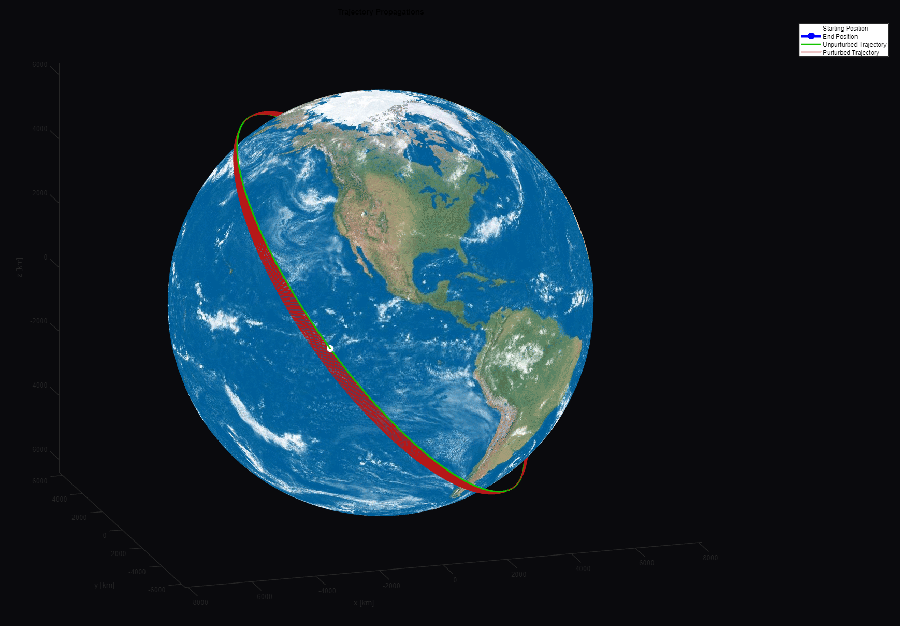
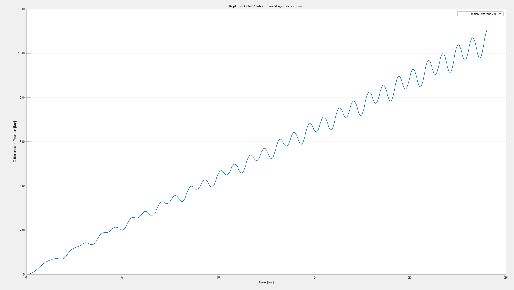

# Orbital Perturbations Simulation
Note: still work in progress

MATLAB script that numerically simulates orbital trajectory over time given initial position and velocity vector and compares simulated trajectory to an unperturbed one. Includes perturbations from J2 effect, drag, solar pressure, and 3rd bodies.

To run: download this repository and run OrbitalPerturbations.m using MATLAB. Code specifies input variables for simulation at top of file.

## Example of Results for an Orbit

### Plot of perturbed orbit (red) over time compared to unpurturbed original orbit (green).

### Plot of distance between perturbed and unperturbed orbits over time for each timestep.

