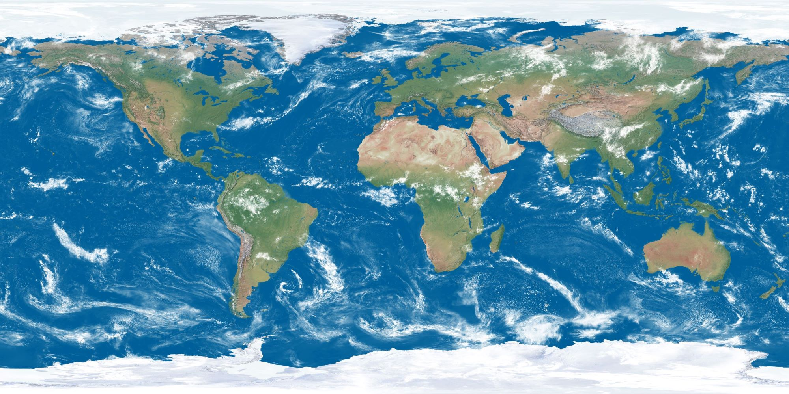

# Orbital-Perturbations-Simulation
MATLAB script that numerically simulates orbital trajectory over time given initial position and velocity vector and compares simulated trajectory to an unperturbed one. Includes perturbations from J2 effect, drag, solar pressure, and 3rd bodies.

### Example Results

